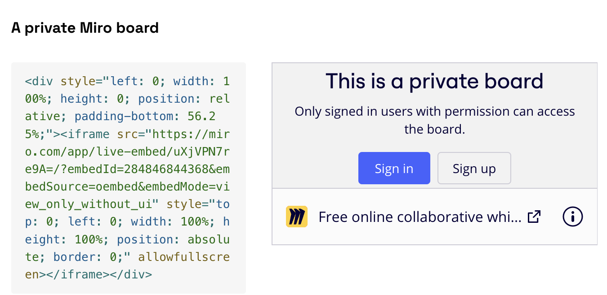
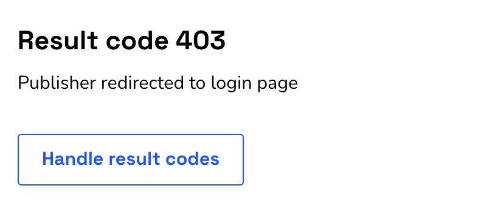
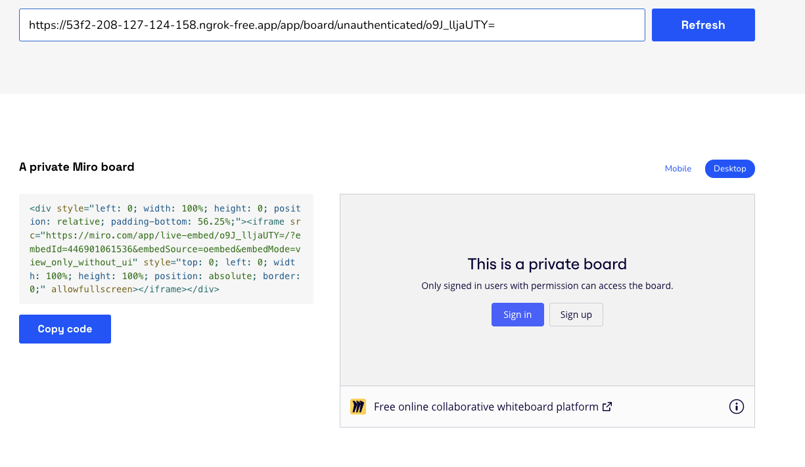

# oEmbed private unfurling PoC

A small app that shows a minimal PoC of oEmbed discovery mechanism.

## Requirements

Enable unfurling of private Miro boards via oEmbed, and iFramely in particular. This means:
 - user pastes the URL of a private board e.g. `https://miro.com/app/board/o9J_lljaUTY=` into an iFramely experience
 - iFramely unfurls the board into an iframe embed




## Problems we've enountered

Private Miro boards automatically redirect to login/signup screens if the user is unauthenticated. iFramely makes calls from it's backend, which does not have user authentication. So far, this is expected. 

However, there are 2 behaviours that get in the way of unfurling these private resources:
* iFramely does not discover oEmbed endpoints using Link headers on redirect responses.
* iFramely seems to short-circuit `/login` and `/signup` paths to an error response, so does not discover oEmbed endpoint in the meta tags in the HTML of our login/signup pages



## Options

### A (preferred) - iFramely discovers oEmbed endpoints from Link headers on redirect responses

Request
```
GET https://miro.com/app/board/o9J_lljaUTY=
```
Reponse
```
302 /login

Link: <https://miro.com/api/v1/oembed?format=json&url=https%3A%2F%2Fmiro.com%2Fapp%2Fboard%2Fo9J_lljaUTY%3D>; rel="alternate"; type="application/json+oembed"; title="Test page link JSON",<https://miro.com/api/v1/oembed?format=xml&url=https%3A%2F%2Fmiro.com%2Fapp%2Fboard%2Fo9J_lljaUTY%3D>; rel="alternate"; type="text/xml+oembed"; title="Test page link XML"
```

Tradeoff

\+ Simple implementation on Miro-end; all information available to set the Link headers when the response is created<br>
\+ Allows iFramely not to need to navigate & process the redirect (optimiziation)<br>
\+ Technically oEmbed compatible<br>
\- Requires tweaks made by iFramely. Unclear how difficult this would be fore them.


### B - iFramely discovers oEmbed endpoints from meta tags on the authentication page

Request
```
GET https://miro.com/app/board/o9J_lljaUTY=
```
Reponse
```
302 /login?from=app/board/o9J_lljaUTY=
```
On login page
```

<!DOCTYPE html>
<html>

  <head>
    ...

    <link rel="alternate" type="application/json+oembed"
      href="https://miro.com/api/v1/oembed?url=https://miro.com/app/board/o9J_lljaUTY&#x3D;/&format=json"
      title="Embedded Miro board (via oembed link tag, JSON)" />
    <link rel="alternate" type="text/xml+oembed"
      href="https://miro.com/api/v1/oembed?url=https://miro.com/app/board/o9J_lljaUTY&#x3D;/&format=xml"
      title="Embedded Miro board  (via oembed link tag, XML)" />
  </head>

  ...

</html>
```

Tradeoff

\+ (minor) Only relies on HTML tags<br>
\- Additional complexity on Miro end. Resource information needs to be forwarded to the new page, and used to populate link tags.<br>
\- Requires tweaks made by iFramely to NOT short-circuit to a 403 response. Unclear how difficult this would be fore them.<br>
\- Not necessarily oEmbed compatible. oEmbed spec doesn't specify expected redirection behaviours.<br>


### C (curent approach) - we send dummy page when we notice iFramely

Request
```
GET https://miro.com/app/board/o9J_lljaUTY=
Useragent: useragent: Iframely/1.3.1 (+https://iframely.com/docs/about)
```
Reponse
```
<!DOCTYPE html>
<html>

  <head>
    ...

    <link rel="alternate" type="application/json+oembed"
      href="https://miro.com/api/v1/oembed?url=https://miro.com/app/board/o9J_lljaUTY&#x3D;/&format=json"
      title="Embedded Miro board (via oembed link tag, JSON)" />
    <link rel="alternate" type="text/xml+oembed"
      href="https://miro.com/api/v1/oembed?url=https://miro.com/app/board/o9J_lljaUTY&#x3D;/&format=xml"
      title="Embedded Miro board  (via oembed link tag, XML)" />
  </head>

  ...

</html>
```

Tradeoff

\+ No work required by iFramely<br>
\- Adds complexity to Miro side; need to render different pages on the same path. Makes page behaviour less deterministic.<br>
\- Only solves iFramely case - each new case would require a new user agent to be detected.<br>
\- Will not work if user-agent headers are not set as exected (brittle solution).<br>


## Installation

```bash
$ npm install
```

## Running the app

```bash
# development
$ npm run start

# watch mode
$ npm run start:dev

# production mode
$ npm run start:prod
```

## Testing using iFramely & ngrok

 - You can test the iFramely flow [using this link](https://iframely.com/try?url=https%3A%2F%2F53f2-208-127-124-158.ngrok-free.app%2Foembed%2Fredirect%2Fo9J_lljaUTY%3D%3Fhello%3Dworld).
 - iFramely doesn't allow calls against localhost. You can use https://ngrok.com/ to get a domain online with which to call.

Running ngrok
```
ngrok http http://localhost:3000
```

The iFramely /try page



### Flows to try (run these from the iFramely /try page)

* Load a "board" directly: `https://<ngrok-url>/app/board/o9J_lljaUTY=`
    * Unfurls correctly.
* Redirect to a non-auth page: `https://<ngrok-url>/app/board/o9J_lljaUTY=?redirect=foo`
    * Unfurls correctly. Proves that redirects to a page that contains meta-tags works.
* Return a "dummy" page if iFramely is detected: `https://<ngrok-url>/app/board/o9J_lljaUTY=?dummy=true`
    * Unfurls correctly, but not the most sustainable option.
* Redirect to the login page: `https://<ngrok-url>/app/board/o9J_lljaUTY=?redirect=login`
    * 2023-03 - iFramley short-circuits to 403
* Redirect to the signup page: `https://<ngrok-url>/app/board/o9J_lljaUTY=?redirect=signup`
    * 2023-03 - iFramley short-circuits to 403